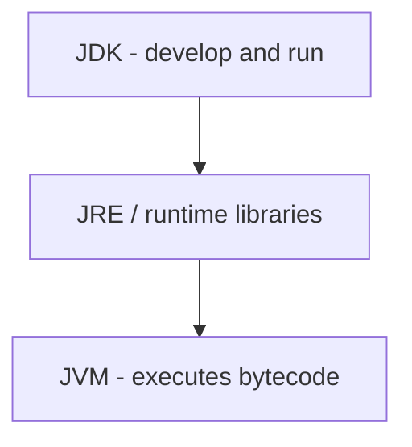
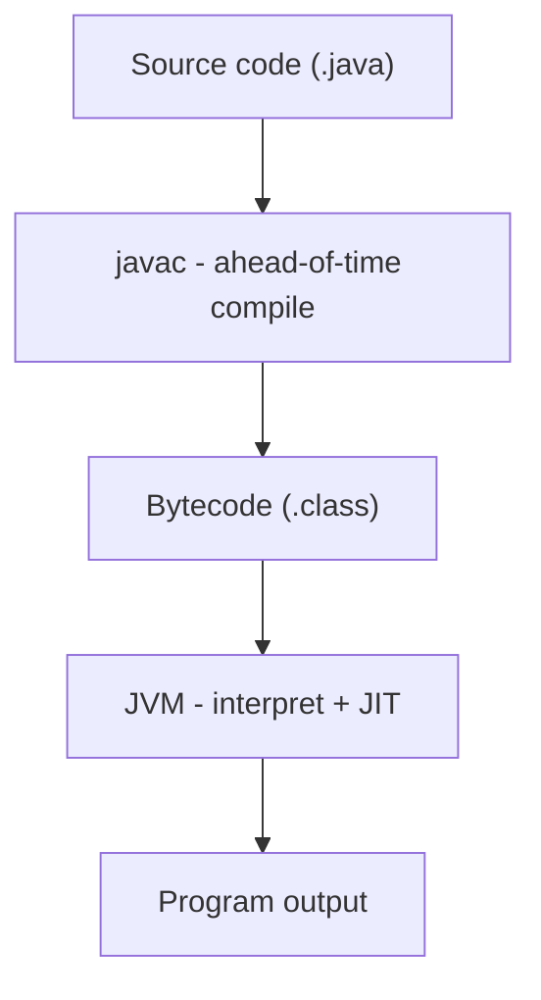

# Chapter 1: Introduction to Java

## Objectives

- Understand Java's design philosophy and where it fits in the programming landscape
- Distinguish between compiled and interpreted languages, and understand why Java is both
- Distinguish between the JDK, JRE, and JVM
- Compile and run a Java program from the command line
- Understand the relationship between source code, bytecode, and the JVM

## Concepts

### History and Philosophy

Java was created by James Gosling at Sun Microsystems in 1995. Its core design principles are:

- **Write once, run anywhere** — Java compiles to bytecode that runs on any JVM, regardless of the underlying OS or hardware.
- **Object-oriented** — everything (except primitives) is an object.
- **Strongly typed** — the compiler catches type errors before the program runs.
- **Memory-managed** — the garbage collector handles memory allocation and deallocation.

### JDK, JRE, JVM

| Component                        | What it is                                      | Contains                                             |
|----------------------------------|------------------------------------------------|------------------------------------------------------|
| **JVM** (Java Virtual Machine)   | The runtime engine that executes bytecode       | Interpreter, JIT compiler, garbage collector         |
| **JRE** (Java Runtime Environment) | Everything needed to *run* Java programs       | JVM + standard library (rt.jar / modules)            |
| **JDK** (Java Development Kit)   | Everything needed to *develop* Java programs    | JRE + `javac`, `jshell`, `jpackage`, debugger, etc.  |

> Since Java 11, the JRE is no longer distributed separately. The JDK is the only download.



### Compiled vs. Interpreted Languages

Programming languages are often described as either **compiled** or **interpreted**, but the distinction is really about implementation strategy, not the language itself.

| Strategy         | How it works                                                                                                                                      | Examples                               |
|------------------|---------------------------------------------------------------------------------------------------------------------------------------------------|----------------------------------------|
| **Compiled**     | Source code is translated to machine code *before* execution. The compiler catches errors early and produces a fast binary, but it's platform-specific. | C, C++, Rust, Go                       |
| **Interpreted**  | Source code is read and executed line by line at runtime. No separate compilation step, but errors only surface when the faulty line runs.           | Python, Ruby, JavaScript (historically) |

**Java does both.** `javac` compiles source code to **bytecode** — an intermediate representation that is neither source code nor native machine code. The JVM then interprets this bytecode at runtime. For frequently executed code paths, the JVM's **JIT (Just-In-Time) compiler** goes further and compiles bytecode to optimized native machine code on the fly.

This two-stage approach gives Java the best of both worlds:
- The compiler catches type errors, missing methods, and syntax problems *before* the program runs.
- Bytecode is platform-independent, enabling "write once, run anywhere."
- JIT compilation delivers near-native performance for hot code paths.

### Compilation and Execution



1. You write source code in `.java` files.
2. `javac` compiles source code into `.class` files containing bytecode.
3. `java` launches the JVM, which loads and executes the bytecode. Hot code paths are JIT-compiled to native machine code for performance.

Bytecode is platform-independent. The JVM is platform-specific. This is the mechanism behind "write once, run anywhere."

### Your First Program

See [`HelloWorld.java`](src/main/java/course/ch01/examples/HelloWorld.java):

```java
package course.ch01.examples;

public class HelloWorld {
    public static void main(String[] args) {
        System.out.println("Hello, World!");
    }
}
```

Every Java program needs:
- A `class` declaration — the file name must match the class name.
- A `main` method with the exact signature `public static void main(String[] args)` — this is the entry point.
- `System.out.println` writes to standard output.

**Compile and run from the command line:**

```bash
javac src/main/java/course/ch01/examples/HelloWorld.java
java -cp src/main/java course.ch01.examples.HelloWorld
```

Or use Maven:

```bash
mvn compile exec:java -Dexec.mainClass="course.ch01.examples.HelloWorld"
```

### A Simpler Start (Java 25)

Since Java 25 ([JEP 512](https://openjdk.org/jeps/512)), a **compact source file** can omit the class declaration and the traditional `main` signature. See [`compact-examples/HelloWorld.java`](compact-examples/HelloWorld.java):

```java
void main() {
    System.out.println("Hello, World!");
}
```

Run directly from the source file — no separate `javac` step:

```bash
cd 01-introduction-to-java/compact-examples
java HelloWorld.java
```

**What happens behind the scenes**

1. The `java` launcher **compiles** the source to bytecode (in memory or a temp directory).
2. With no class declaration, the compiler creates an **implicit final class** that wraps your top-level methods and fields.
3. The launcher picks a **launchable** `main` method — here, the instance method `void main()` — creates an object, and invokes it.
4. The JVM **loads and executes** that bytecode — the same interpret + JIT pipeline described above.

The explicit form in the previous section is what real projects and this course use: packages, access modifiers, and `public static void main(String[] args)` matter once you move beyond hello-world. Compact files must live in the **unnamed package**, so they cannot replace the Maven module layout used from Chapter 1 onward.

## Examples

| File                                                                     | Demonstrates                                       |
|--------------------------------------------------------------------------|---------------------------------------------------|
| [`HelloWorld.java`](src/main/java/course/ch01/examples/HelloWorld.java)  | Minimal Java program — class, main method, println |
| [`JvmInfo.java`](src/main/java/course/ch01/examples/JvmInfo.java)        | Querying JVM properties at runtime                 |

## Exercises

### Exercise 1: Greeting (Guided)

**File:** [`Greeting.java`](src/main/java/course/ch01/exercises/Greeting.java)

Write a program that prints `Hello, <name>!` where `<name>` is passed as a command-line argument. If no argument is provided, print `Hello, World!`.

Run the tests to verify:

```bash
mvn test -Dtest="course.ch01.exercises.GreetingTest"
```

### Exercise 2: System Reporter (Practice)

**File:** [`SystemReporter.java`](src/main/java/course/ch01/exercises/SystemReporter.java)

Write a method that returns a formatted string containing the Java version, OS name, and OS architecture. The exact format is defined by the tests.

```bash
mvn test -Dtest="course.ch01.exercises.SystemReporterTest"
```

## Key Takeaways

- Java source code is compiled to platform-independent **bytecode**, which the **JVM** executes.
- The **JDK** is the development kit; it includes the compiler (`javac`) and the runtime.
- Real projects use `public static void main(String[] args)` in named classes; file name must match the public class name.
- Java 25 **compact source files** can use `void main()` and `java HelloWorld.java` — the launcher still compiles to bytecode for the JVM.

## In-Class Quiz

Optional formative check for live sessions: [Chapter 1 quiz](../quizzes/01-introduction-to-java.md) (answers in collapsible sections). [Slide-friendly version](../quizzes/README.md#present-all-quizzes-recommended).

## Further Reading

- [JLS §7.6 — Top Level Type Declarations](https://docs.oracle.com/javase/specs/jls/se25/html/jls-7.html#jls-7.6)
- [Oracle: Getting Started](https://docs.oracle.com/en/java/javase/25/docs/api/)
- [JEP 512: Compact Source Files and Instance Main Methods](https://openjdk.org/jeps/512)
- [JEP 458: Launch Multi-File Source-Code Programs](https://openjdk.org/jeps/458)
