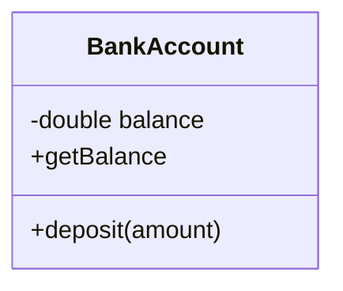
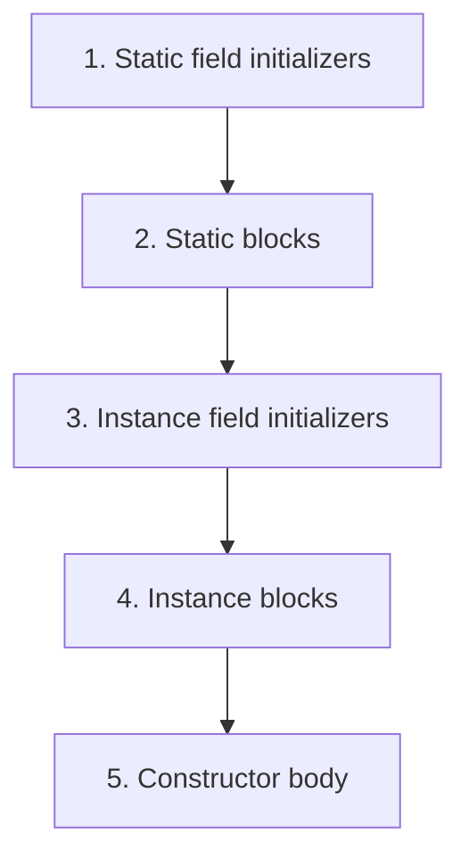

# Chapter 4: Classes and Objects

## Objectives

- Understand how classes serve as blueprints for objects
- Declare fields, constructors, and methods
- Use the `this` keyword to refer to the current instance
- Apply access modifiers (`private`, `protected`, `public`, package-private) to enforce encapsulation
- Combine member modifiers (`static`, `final`) and read them in conventional order
- Distinguish between static (class-level) and instance (object-level) members
- Explain initialization blocks and the order in which fields, blocks, and constructors run

## Concepts

### Classes and Objects

A **class** defines the structure and behavior of a type. An **object** is a concrete instance of that class, created with the `new` keyword.

```java
public class Dog {
    String name;
    int age;
}

Dog d = new Dog();   // create an instance
d.name = "Rex";
d.age = 3;
```

### Fields

Fields are variables declared inside a class. They hold the **state** of an object.

```java
public class Point {
    double x;
    double y;
}
```

Each instance gets its own copy of instance fields. Fields that are not explicitly initialized receive a default value (`0` for numeric types, `false` for `boolean`, `null` for references).

### Constructors

A constructor initializes a new object. It has the same name as the class and no return type:

```java
public class Point {
    double x;
    double y;

    public Point(double x, double y) {
        this.x = x;   // 'this' distinguishes field from parameter
        this.y = y;
    }
}

var p = new Point(3.0, 4.0);
```

If you don't write any constructor, Java provides a default no-argument constructor. Once you write at least one, the default disappears.

### The `this` Keyword

`this` refers to the current instance. Common uses:

| Usage                        | Example                                      |
|------------------------------|----------------------------------------------|
| Disambiguate field from parameter | `this.name = name;`                     |
| Call another constructor     | `this(defaultValue);` (first statement only) |
| Pass current object          | `list.add(this);`                            |

### Methods

Methods define **behavior**. An instance method operates on the object it is called on:

```java
public class BankAccount {
    private double balance;

    public void deposit(double amount) {
        this.balance += amount;
    }

    public double getBalance() {
        return balance;
    }
}
```

### Access Modifiers

Access modifiers control **visibility** — who can see a field, method, or class:

| Modifier        | Class | Package | Subclass | World |
|-----------------|:-----:|:-------:|:--------:|:-----:|
| `public`        |  ✓    |    ✓    |    ✓     |   ✓   |
| `protected`     |  ✓    |    ✓    |    ✓     |       |
| *(none)*        |  ✓    |    ✓    |          |       |
| `private`       |  ✓    |         |          |       |

*(none)* is called **package-private** — accessible within the same package only.

**Best practice:** make fields `private` and provide `public` getter/setter methods only when needed. This is **encapsulation** — hiding internal state and exposing a controlled interface.



```java
public class Temperature {
    private double celsius;

    public Temperature(double celsius) {
        this.celsius = celsius;
    }

    public double getCelsius() {
        return celsius;
    }

    public double getFahrenheit() {
        return celsius * 9.0 / 5.0 + 32;
    }
}
```

### Static Members

A `static` field or method belongs to the **class**, not to any instance. There is exactly one copy, shared by all instances.

```java
public class Counter {
    private static int totalCount;   // one copy, shared
    private int count;               // one copy per instance

    public void increment() {
        count++;
        totalCount++;
    }

    public static int getTotalCount() {
        return totalCount;
    }
}
```

**Key rules:**
- Static methods cannot access instance fields or call instance methods directly — they have no `this`.
- Instance methods *can* access static members.
- Access static members through the class name: `Counter.getTotalCount()`.

### Combining Modifiers

Fields and methods can carry more than one modifier. The compiler accepts any order, but teams follow a conventional sequence:

```
access → static → final
```

| Example | Meaning |
|---------|---------|
| `public static final int MAX = 100;` | Class constant, visible everywhere |
| `private static int count;` | Per-class mutable state, hidden from outside |
| `private final String name;` | Set once per instance (usually in the constructor) |

`final` on a field means it must be assigned exactly once — at declaration or in every constructor. `static final` is the usual pattern for named constants.

### Initialization Blocks

Besides constructors, a class can run code in **initializer blocks**:

```java
public class Cache {
    private static final Map<String, String> STORE = new HashMap<>();

    static {
        STORE.put("default", "value");   // runs once when the class is first used
    }

    private final String key;

    {
        System.out.println("Preparing entry");   // runs before each constructor
    }

    public Cache(String key) {
        this.key = key;
    }
}
```

| Construct | When it runs | How often |
|-----------|--------------|-----------|
| Static field initializer | When the class is first loaded | Once per class |
| `static { }` block | After static fields, in source order | Once per class |
| Instance field initializer | Before each constructor | Once per object |
| `{ }` instance block | After instance fields, before constructor body | Once per object |
| Constructor | Last step of object creation | Once per object |

**Order when you call `new Cache("k")`:**



Chapter 5 extends this when inheritance is involved — the superclass finishes its initialization before the subclass constructor body runs.

## Examples

| File                                                                                | Demonstrates                                           |
|-------------------------------------------------------------------------------------|--------------------------------------------------------|
| [`BankAccount.java`](src/main/java/course/ch04/examples/BankAccount.java)           | Fields, constructor, methods, `this`, encapsulation     |
| [`Counter.java`](src/main/java/course/ch04/examples/Counter.java)                   | Static vs. instance fields, static methods              |
| [`InitializationOrder.java`](src/main/java/course/ch04/examples/InitializationOrder.java) | Static/instance blocks and field initializer order |

## Exercises

### Exercise 1: Rectangle (Guided)

**File:** [`Rectangle.java`](src/main/java/course/ch04/exercises/Rectangle.java)

Implement a `Rectangle` class with:
- Private `width` and `height` fields (reject non-positive values)
- `area()` — returns width × height
- `perimeter()` — returns 2 × (width + height)
- `toString()` — returns `"Rectangle{width=W, height=H}"`

```bash
mvn test -Dtest="course.ch04.exercises.RectangleTest"
```

### Exercise 2: Student (Practice)

**File:** [`Student.java`](src/main/java/course/ch04/exercises/Student.java)

Implement a `Student` class with:
- A name (reject `null` or empty) and a list of grades
- `addGrade(double)` — adds a grade (must be 0–100)
- `getAverage()` — returns the arithmetic mean (throw if no grades)
- `getHighest()` — returns the maximum grade (throw if no grades)
- `getGrades()` — returns an unmodifiable view

```bash
mvn test -Dtest="course.ch04.exercises.StudentTest"
```

### Exercise 3: Stopwatch (Challenge)

**File:** [`Stopwatch.java`](src/main/java/course/ch04/exercises/Stopwatch.java)

Implement a `Stopwatch` using `System.nanoTime()`:
- `start()` — begins timing (throw if already running)
- `stop()` — stops and accumulates elapsed time (throw if not running)
- `elapsedMillis()` — returns total milliseconds (includes current run if still going)
- `reset()` — clears accumulated time and stops if running

```bash
mvn test -Dtest="course.ch04.exercises.StopwatchTest"
```

## Key Takeaways

- A class defines a **type** with state (fields) and behavior (methods).
- Constructors initialize objects — use `this` to disambiguate parameters from fields.
- Make fields `private` and expose only what clients need — this is **encapsulation**.
- `static` members belong to the class, not to instances — use them for shared state and utility methods.
- Combine modifiers in conventional order: access, then `static`, then `final`.
- Initialization blocks run in a fixed order — static once per class, instance before every constructor.
- Prefer the most restrictive access level that works.

## In-Class Quiz

Optional formative check for live sessions: [Chapter 4 quiz](../quizzes/04-classes-and-objects.md) (answers in collapsible sections). [Slide-friendly version](../quizzes/README.md#present-all-quizzes-recommended).

## Further Reading

- [JLS §8.2 — Class Members](https://docs.oracle.com/javase/specs/jls/se25/html/jls-8.html#jls-8.2)
- [JLS §8.3 — Field Declarations](https://docs.oracle.com/javase/specs/jls/se25/html/jls-8.html#jls-8.3)
- [JLS §8.8 — Constructor Declarations](https://docs.oracle.com/javase/specs/jls/se25/html/jls-8.html#jls-8.8)
- Effective Java, Item 15: Minimize the accessibility of classes and members
- Effective Java, Item 16: In public classes, use accessor methods, not public fields
