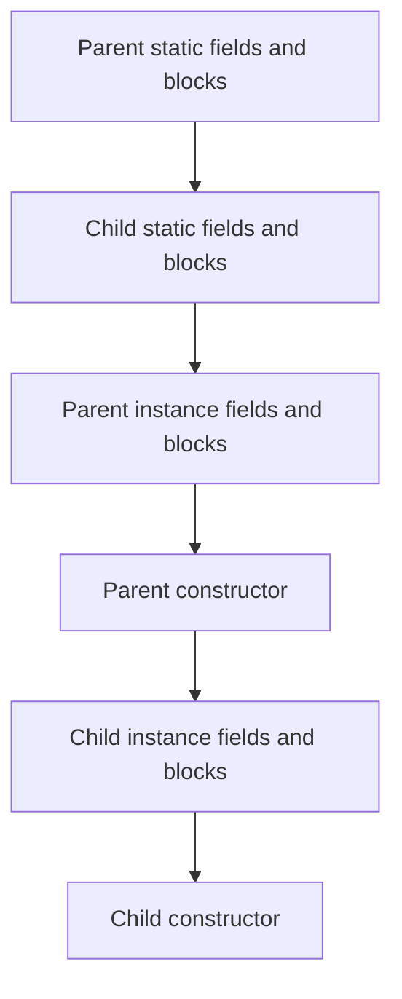

# Chapter 5: Inheritance and Polymorphism

## Objectives

- Extend a class using `extends` and call the superclass constructor with `super`
- Override methods and understand dynamic dispatch (the JVM picks the method at runtime)
- Define abstract classes that force subclasses to provide implementations
- Override `equals`, `hashCode`, and `toString` from the `Object` class correctly

## Concepts

### Extending Classes

A subclass **inherits** all accessible fields and methods from its superclass and can add its own:

```java
public class Vehicle {
    private final String make;

    public Vehicle(String make) {
        this.make = make;
    }

    public String describe() {
        return make + " vehicle";
    }
}

public class Car extends Vehicle {
    private final int doors;

    public Car(String make, int doors) {
        super(make);          // must be first statement
        this.doors = doors;
    }
}
```

Java supports **single inheritance** only — a class can extend at most one superclass. Every class implicitly extends `Object` if no superclass is specified.

### `super`

| Usage                        | Example                         |
|------------------------------|---------------------------------|
| Call superclass constructor  | `super(make);` (first line)     |
| Call overridden method       | `super.describe()`              |
| Access superclass field      | `super.field` (if accessible)   |

### Initialization Order with Inheritance

Chapter 4 covered initialization within a single class. With inheritance, the **superclass always finishes before the subclass constructor body runs**:



That is why `super(...)` must be the first statement in a subclass constructor — the parent must be fully constructed before the child adds its own state. Chapter 28 connects this sequence to JVM class loading and `<clinit>`.

### Method Overriding and Dynamic Dispatch

A subclass can **override** a method by providing a new implementation with the same signature:

```java
public class Car extends Vehicle {
    @Override
    public String describe() {
        return getMake() + " car with " + doors + " doors";
    }
}
```

At runtime, the JVM uses **dynamic dispatch** — it looks at the actual type of the object, not the declared type of the variable:

```java
Vehicle v = new Car("Toyota", 4);
v.describe();   // → "Toyota car with 4 doors" (Car's version)
```


The `@Override` annotation is optional but strongly recommended — the compiler will catch typos in the method name or mismatched parameter types.

### Abstract Classes

An **abstract class** cannot be instantiated. It can declare abstract methods that subclasses must implement:

```java
public abstract class Shape {
    public abstract double area();
    public abstract double perimeter();
}

public class Circle extends Shape {
    private final double radius;

    public Circle(double radius) {
        this.radius = radius;
    }

    @Override
    public double area() {
        return Math.PI * radius * radius;
    }

    @Override
    public double perimeter() {
        return 2 * Math.PI * radius;
    }
}
```

Abstract classes can also have concrete methods and fields — they are a mix of "contract" (abstract methods) and "shared behavior" (concrete methods).

### Object Class Methods

Every class inherits from `Object`. Three methods you will commonly override:

**`toString()`** — returns a human-readable representation:

```java
@Override
public String toString() {
    return "Employee{name='" + name + "', salary=" + salary + "}";
}
```

**`equals(Object)`** — defines logical equality:

```java
@Override
public boolean equals(Object o) {
    if (this == o) return true;
    if (o == null || getClass() != o.getClass()) return false;
    var other = (Employee) o;
    return Double.compare(salary, other.salary) == 0
            && Objects.equals(name, other.name);
}
```

**`hashCode()`** — must be consistent with `equals` (equal objects must have the same hash code):

```java
@Override
public int hashCode() {
    return Objects.hash(name, salary);
}
```

**The contract:** if you override `equals`, you **must** override `hashCode`. Otherwise, objects that are "equal" will not behave correctly in hash-based collections like `HashMap` and `HashSet`.

## Examples

| File                                                                                                 | Demonstrates                                           |
|------------------------------------------------------------------------------------------------------|--------------------------------------------------------|
| [`Shape.java`](src/main/java/course/ch05/examples/Shape.java) + Circle, Rectangle                    | Abstract classes, method overriding, polymorphic calls  |
| [`Vehicle.java`](src/main/java/course/ch05/examples/Vehicle.java) + Car, Motorcycle                  | `extends`, `super`, dynamic dispatch                    |

## Exercises

### Exercise 1: Animal Hierarchy (Guided)

**Files:** [`Animal.java`](src/main/java/course/ch05/exercises/Animal.java), [`Dog.java`](src/main/java/course/ch05/exercises/Dog.java), [`Cat.java`](src/main/java/course/ch05/exercises/Cat.java)

Implement:
- `Animal.speak()` — returns `"..."`
- `Dog.speak()` — returns `"Woof!"`
- `Cat.speak()` — returns `"Meow!"`
- `toString()` for each — returns `"ClassName{name='...'}"` (e.g. `"Dog{name='Rex'}"`)

```bash
mvn test -Dtest="course.ch05.exercises.AnimalTest"
```

### Exercise 2: Employee Hierarchy (Practice)

**Files:** [`Employee.java`](src/main/java/course/ch05/exercises/Employee.java), [`Manager.java`](src/main/java/course/ch05/exercises/Manager.java), [`Developer.java`](src/main/java/course/ch05/exercises/Developer.java)

Implement `equals`, `hashCode`, and `toString` for the hierarchy:
- Use `getClass()` (not `instanceof`) so an `Employee` is never equal to a `Manager`
- `Manager` adds a `department` field; `Developer` adds a `language` field
- Subclass `equals`/`hashCode` should call `super.equals`/`super.hashCode`

```bash
mvn test -Dtest="course.ch05.exercises.EmployeeTest"
```

### Exercise 3: Expression Tree (Challenge)

**Files:** [`Expr.java`](src/main/java/course/ch05/exercises/Expr.java), [`Num.java`](src/main/java/course/ch05/exercises/Num.java), [`Add.java`](src/main/java/course/ch05/exercises/Add.java), [`Mul.java`](src/main/java/course/ch05/exercises/Mul.java)

Build an expression tree for arithmetic:
- `Num(42).eval()` → `42.0`
- `new Add(new Num(2), new Num(3)).eval()` → `5.0`
- `new Mul(new Add(new Num(2), new Num(3)), new Num(4)).eval()` → `20.0`
- `toString()` returns parenthesized form: `"((2.0 + 3.0) * 4.0)"`

```bash
mvn test -Dtest="course.ch05.exercises.ExprTest"
```

## Key Takeaways

- **Inheritance** lets you reuse and specialize behavior — but favor composition over deep hierarchies.
- **Dynamic dispatch** means the JVM calls the method defined by the object's actual type, not the variable's declared type.
- **Abstract classes** define a contract that subclasses must fulfill.
- Always override `hashCode` when you override `equals` — the contract demands it.
- Use `@Override` on every overridden method to catch mistakes at compile time.

## In-Class Quiz

Optional formative check for live sessions: [Chapter 5 quiz](../quizzes/05-inheritance-and-polymorphism.md) (answers in collapsible sections). [Slide-friendly version](../quizzes/README.md#present-all-quizzes-recommended).

## Further Reading

- [JLS §8.1.4 — Superclasses and Subclasses](https://docs.oracle.com/javase/specs/jls/se25/html/jls-8.html#jls-8.1.4)
- [JLS §8.4.8 — Inheritance, Overriding, and Hiding](https://docs.oracle.com/javase/specs/jls/se25/html/jls-8.html#jls-8.4.8)
- Effective Java, Item 10: Obey the general contract when overriding equals
- Effective Java, Item 11: Always override hashCode when you override equals
