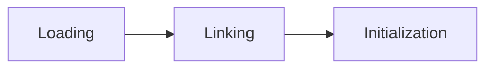
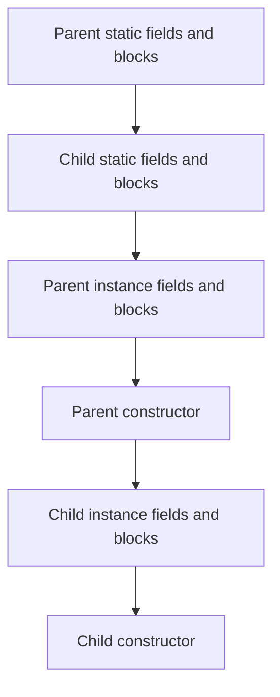
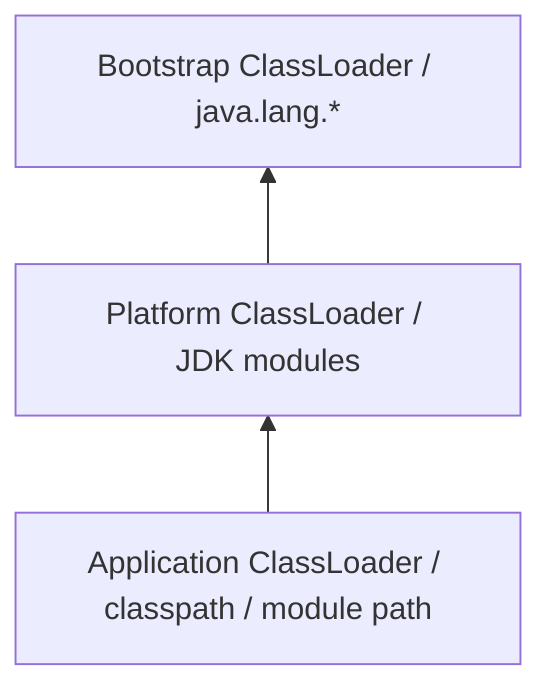
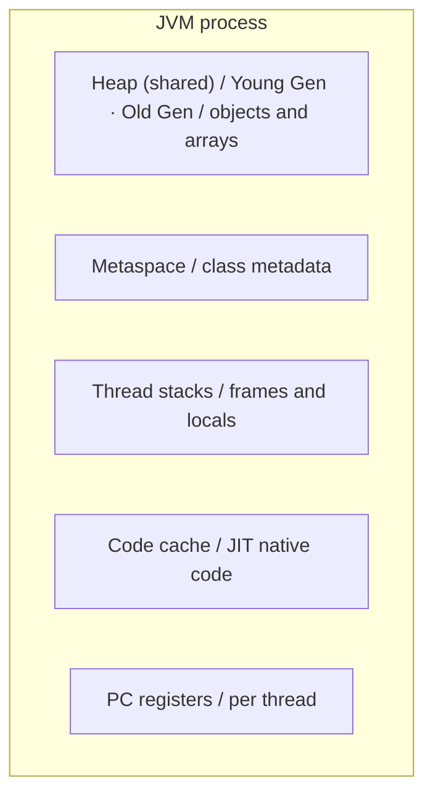

# Chapter 28: JVM Internals

## Objectives

- Understand how the JVM loads and initializes classes
- Map the major JVM memory areas (heap, metaspace, stacks, PC registers)
- Explain garbage collection algorithms and collector trade-offs
- Describe how the JIT compiler optimizes hot code
- Use diagnostic tools to observe JVM behavior at runtime

## Concepts

### Class Loading

The JVM loads classes lazily — a class is loaded when first referenced. The process has three phases:

| Phase        | What happens                                                       |
|--------------|--------------------------------------------------------------------|
| Loading      | Read `.class` bytes, create a `Class` object in metaspace          |
| Linking      | Verify bytecode, prepare static fields, resolve symbolic references |
| Initialization | Run static initializers (`<clinit>`) in source order           |



**Initialization order** for a class hierarchy (introduced in [Chapter 4](../04-classes-and-objects/README.md), extended here for inheritance):



Class loaders form a delegation hierarchy:



Each loader asks its parent first, ensuring core classes cannot be spoofed.

### Memory Areas



| Area         | Stores                          | GC?    | Size flag              |
|--------------|---------------------------------|--------|------------------------|
| Heap         | Object instances, arrays        | Yes    | `-Xmx`, `-Xms`         |
| Metaspace    | Class metadata, method bytecode | Yes*   | `-XX:MaxMetaspaceSize` |
| Thread stack | Method frames, local variables  | No     | `-Xss`                 |
| Code cache   | JIT-compiled machine code       | No     | `-XX:ReservedCodeCacheSize` |

*Metaspace is collected when classes are unloaded (rare in typical apps).

Access heap stats programmatically:

```java
Runtime rt = Runtime.getRuntime();
long used  = rt.totalMemory() - rt.freeMemory();
long max   = rt.maxMemory();
```

### Garbage Collection

GC reclaims objects that are no longer reachable. The JVM uses **reachability** from GC roots (thread stacks, static fields, JNI references).

**Generational hypothesis:** most objects die young. The heap is divided:

| Generation | Contents                    | Collector activity        |
|------------|-----------------------------|---------------------------|
| Young      | Newly allocated objects     | Frequent, fast minor GC   |
| Old        | Long-lived survivors        | Infrequent, slower major GC |

**Common collectors in Java 25:**

| Collector   | Flag                  | Best for                          |
|-------------|-----------------------|-----------------------------------|
| G1 (default)| (none needed)         | General-purpose, balanced latency |
| ZGC         | `-XX:+UseZGC`         | Very low pause times, large heaps |
| Shenandoah  | `-XX:+UseShenandoahGC`| Low pause, concurrent compaction  |
| Serial      | `-XX:+UseSerialGC`    | Small heaps, single-threaded apps |

Observe GC via JMX:

```java
List<GarbageCollectorMXBean> beans = ManagementFactory.getGarbageCollectorMXBeans();
for (GarbageCollectorMXBean bean : beans) {
    System.out.println(bean.getName() + ": " + bean.getCollectionCount());
}
```

### JIT Compilation

The JVM starts by interpreting bytecode. HotSpot profiles execution and **JIT-compiles** frequently executed ("hot") methods to native machine code.

| Tier            | Description                                    |
|-----------------|------------------------------------------------|
| Interpreter     | Bytecode interpreted line by line (startup)    |
| C1 (client)     | Fast compilation, light optimization           |
| C2 (server)     | Aggressive optimization (inlining, loop unroll)|
| Graal (optional)| Experimental/AOT JIT in some distributions     |

Key optimizations:

- **Inlining** — replace method calls with the method body
- **Escape analysis** — allocate on the stack if an object doesn't escape
- **Dead code elimination** — remove unreachable branches
- **Loop unrolling** — reduce branch overhead in tight loops

Control JIT behavior:

```bash
# Print methods compiled by C2
java -XX:+PrintCompilation MyApp

# Disable JIT (interpret only — for debugging)
java -Xint MyApp

# Force compilation threshold lower (debugging)
java -XX:CompileThreshold=100 MyApp
```

### Diagnostic Tools

| Tool            | Purpose                                      | Example                                  |
|-----------------|----------------------------------------------|------------------------------------------|
| `jcmd`          | Send commands to a running JVM               | `jcmd <pid> VM.flags`                    |
| `jps`           | List Java processes                          | `jps -l`                                 |
| `jstat`         | GC and memory statistics                     | `jstat -gc <pid> 1s`                     |
| `jmap`          | Heap dump and class histogram                | `jmap -histo <pid>`                      |
| `jstack`        | Thread dump                                  | `jstack <pid>`                           |
| `jfr`           | Java Flight Recorder (low-overhead profiling)| `jcmd <pid> JFR.start`                   |
| VisualVM        | GUI for monitoring, profiling, heap analysis | Bundled separately since JDK 9           |

Useful JVM flags for diagnostics:

```bash
# Print GC activity
java -Xlog:gc* MyApp

# Heap dump on OutOfMemoryError
java -XX:+HeapDumpOnOutOfMemoryError -XX:HeapDumpPath=/tmp MyApp

# Print final flags
java -XX:+PrintFlagsFinal -version 2>&| grep HeapSize
```

## Examples

| File                                                                                    | Demonstrates                                        |
|-----------------------------------------------------------------------------------------|-----------------------------------------------------|
| [`ClassLoadingOrder.java`](src/main/java/course/ch28/examples/ClassLoadingOrder.java)   | Static and instance initialization order            |
| [`MemoryDemo.java`](src/main/java/course/ch28/examples/MemoryDemo.java)                 | Heap sizing via `Runtime`, allocation, `System.gc()` |
| [`GCObserver.java`](src/main/java/course/ch28/examples/GCObserver.java)                 | GC statistics via `GarbageCollectorMXBean`          |

## Exercises

### Exercise 1: MemoryAnalyzer (Guided)

**File:** [`MemoryAnalyzer.java`](src/main/java/course/ch28/exercises/MemoryAnalyzer.java)

Report heap usage as formatted strings and percentages using `Runtime`.

```bash
mvn test -Dtest="course.ch28.exercises.MemoryAnalyzerTest"
```

### Exercise 2: ClassInspector (Practice)

**File:** [`ClassInspector.java`](src/main/java/course/ch28/exercises/ClassInspector.java)

Extract class metadata (kind, superclass, modifiers, field count) via reflection.

```bash
mvn test -Dtest="course.ch28.exercises.ClassInspectorTest"
```

### Exercise 3: ObjectSizeEstimator (Challenge)

**File:** [`ObjectSizeEstimator.java`](src/main/java/course/ch28/exercises/ObjectSizeEstimator.java)

Estimate object sizes using HotSpot header and alignment heuristics.

```bash
mvn test -Dtest="course.ch28.exercises.ObjectSizeEstimatorTest"
```

## Key Takeaways

- Classes load **lazily** and initialize static members in a defined order: parent before child, static before instance.
- The **heap** holds all objects; **metaspace** holds class metadata; **stacks** hold per-thread method frames.
- **Generational GC** exploits the observation that most objects die young, making minor collections fast.
- The **JIT compiler** profiles hot methods and compiles them to optimized native code after warmup.
- **Diagnostic tools** (`jcmd`, `jstat`, `jfr`, JMX) let you observe memory, GC, and thread behavior in running applications.

## Further Reading

- [JVM Specification — Chapter 5: Loading, Linking, and Initializing](https://docs.oracle.com/javase/specs/jvms/se25/html/jvms-5.html)
- [Inside the Java Virtual Machine (Bill Venners)](https://www.artima.com/insidejvm/)
- [Java Performance (Scott Oaks)](https://www.oreilly.com/library/view/java-performance-2nd/9781492056102/)
- [Unified JVM Logging (`-Xlog`)](https://docs.oracle.com/en/java/javase/25/docs/specs/man/java.html)
