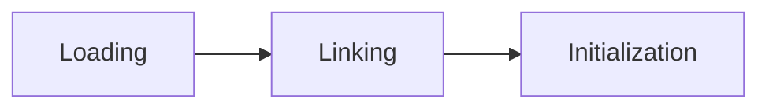
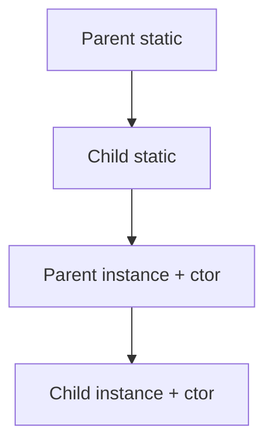
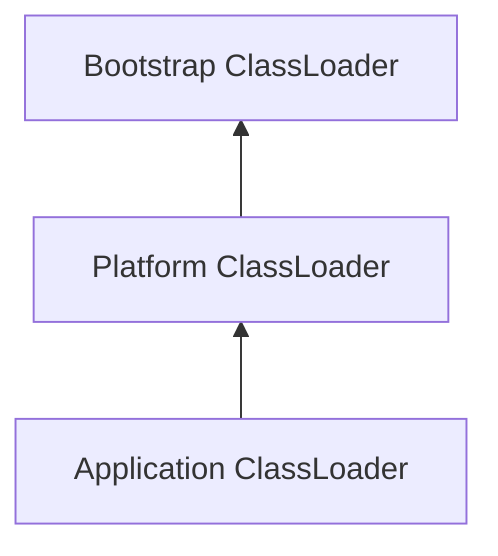
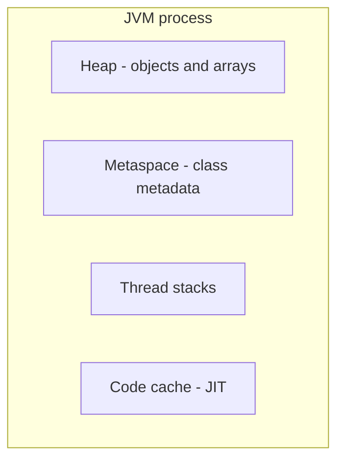

# Chapter 28
## JVM Internals

---

## Objectives

- Understand how the JVM loads and initializes classes
- Map the major JVM memory areas (heap, metaspace, stacks, PC registers)
- Explain garbage collection algorithms and collector trade-offs
- Describe how the JIT compiler optimizes hot code
- Use diagnostic tools to observe JVM behavior at runtime

---

## Class Loading — Three Phases

The JVM loads classes **lazily** — when first referenced:

| Phase | What happens |
|-------|--------------|
| **Loading** | Read `.class` bytes, create a `Class` object in metaspace |
| **Linking** | Verify bytecode, prepare static fields, resolve references |
| **Initialization** | Run static initializers (`<clinit>`) in source order |



---

## Initialization Order



Parent before child; static before instance.

---

## Class Loader Hierarchy



Each loader asks its **parent first**, ensuring core classes cannot be spoofed.

---

## JVM Memory Areas



---

## Memory Areas — Details

| Area | Stores | GC? | Size flag |
|------|--------|-----|-----------|
| Heap | Object instances, arrays | Yes | `-Xmx`, `-Xms` |
| Metaspace | Class metadata, method bytecode | Yes* | `-XX:MaxMetaspaceSize` |
| Thread stack | Method frames, local variables | No | `-Xss` |
| Code cache | JIT-compiled machine code | No | `-XX:ReservedCodeCacheSize` |

*Metaspace collected when classes are unloaded (rare in typical apps).

---

## Heap Stats Programmatically

```java
Runtime rt = Runtime.getRuntime();
long used  = rt.totalMemory() - rt.freeMemory();
long max   = rt.maxMemory();
```

Use `Runtime` for coarse heap visibility; use JMX and `jstat` for production diagnostics.

---

## Garbage Collection

GC reclaims objects no longer **reachable** from GC roots (thread stacks, static fields, JNI references).

**Generational hypothesis:** most objects die young.

| Generation | Contents | Collector activity |
|------------|----------|-------------------|
| Young | Newly allocated objects | Frequent, fast minor GC |
| Old | Long-lived survivors | Infrequent, slower major GC |

---

## Common Collectors (Java 25)

| Collector | Flag | Best for |
|-----------|------|----------|
| G1 (default) | (none needed) | General-purpose, balanced latency |
| ZGC | `-XX:+UseZGC` | Very low pause times, large heaps |
| Shenandoah | `-XX:+UseShenandoahGC` | Low pause, concurrent compaction |
| Serial | `-XX:+UseSerialGC` | Small heaps, single-threaded apps |

---

## Observing GC via JMX

```java
List<GarbageCollectorMXBean> beans =
    ManagementFactory.getGarbageCollectorMXBeans();
for (GarbageCollectorMXBean bean : beans) {
    System.out.println(bean.getName() + ": " + bean.getCollectionCount());
}
```

---

## JIT Compilation

The JVM starts by **interpreting** bytecode. HotSpot profiles execution and JIT-compiles hot methods to native code.

| Tier | Description |
|------|-------------|
| Interpreter | Bytecode interpreted line by line (startup) |
| C1 (client) | Fast compilation, light optimization |
| C2 (server) | Aggressive optimization (inlining, loop unroll) |

Key optimizations: **inlining**, **escape analysis**, **dead code elimination**, **loop unrolling**.

---

## Diagnostic Tools

| Tool | Purpose | Example |
|------|---------|---------|
| `jcmd` | Commands to a running JVM | `jcmd <pid> VM.flags` |
| `jps` | List Java processes | `jps -l` |
| `jstat` | GC and memory statistics | `jstat -gc <pid> 1s` |
| `jmap` | Heap dump, class histogram | `jmap -histo <pid>` |
| `jstack` | Thread dump | `jstack <pid>` |
| `jfr` | Low-overhead profiling | `jcmd <pid> JFR.start` |

```bash
java -Xlog:gc* MyApp
java -XX:+HeapDumpOnOutOfMemoryError MyApp
```

---

## Examples in This Chapter

| File | Topic |
|------|-------|
| `ClassLoadingOrder` | Static and instance initialization order |
| `MemoryDemo` | Heap sizing via `Runtime`, allocation, `System.gc()` |
| `GCObserver` | GC statistics via `GarbageCollectorMXBean` |

```bash
mvn test -pl 28-jvm-internals
```

---

## Exercises — Your Turn

1. **MemoryAnalyzer** (Guided) — report heap usage with `Runtime`
2. **ClassInspector** (Practice) — extract class metadata via reflection
3. **ObjectSizeEstimator** (Challenge) — estimate sizes with HotSpot heuristics

```bash
mvn test -pl 28-jvm-internals -Dtest="MemoryAnalyzerTest"
```

Full lesson: [`README.md`](README.md) · Solutions: `solutions/`

---

## Key Takeaways

- Classes load **lazily** and initialize static members in a defined order
- The **heap** holds objects; **metaspace** holds class metadata; **stacks** hold per-thread frames
- **Generational GC** exploits that most objects die young, making minor collections fast
- The **JIT compiler** profiles hot methods and compiles them after warmup
- **Diagnostic tools** (`jcmd`, `jstat`, `jfr`, JMX) observe memory, GC, and threads at runtime

Further reading: [JVM Spec Ch. 5](https://docs.oracle.com/javase/specs/jvms/se25/html/jvms-5.html) · [Java Performance (Oaks)](https://www.oreilly.com/library/view/java-performance-2nd/9781492056102/)
